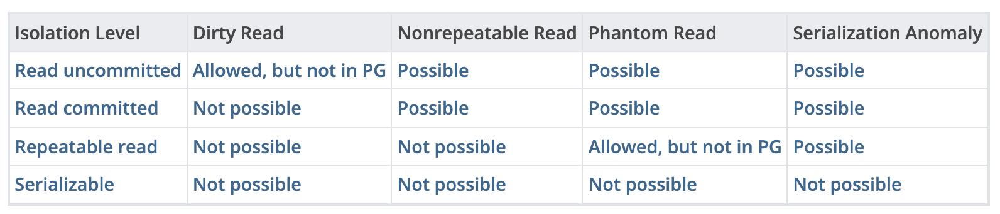

## Transaction Isolation Levels

Trong PostgreSQL, bạn có thể yêu cầu bất kỳ mức cô lập giao dịch tiêu chuẩn nào trong bốn mức, nhưng về mặt nội bộ, chỉ có ba mức cô lập khác biệt được triển khai. Cụ thể, chế độ Read Uncommitted của PostgreSQL hoạt động giống như Read Committed. Điều này là do đây là cách hợp lý duy nhất để ánh xạ các mức cô lập tiêu chuẩn vào kiến trúc kiểm soát đồng thời đa phiên bản (MVCC) của PostgreSQL.

Bảng cũng cho thấy rằng triển khai Repeatable Read của PostgreSQL không cho phép xảy ra phantom reads. Tiêu chuẩn SQL cho phép hành vi nghiêm ngặt hơn: bốn mức cô lập chỉ xác định các hiện tượng không được xảy ra, chứ không xác định các hiện tượng phải xảy ra. Hành vi của các mức cô lập có sẵn sẽ được trình bày chi tiết trong các phần tiếp theo.
